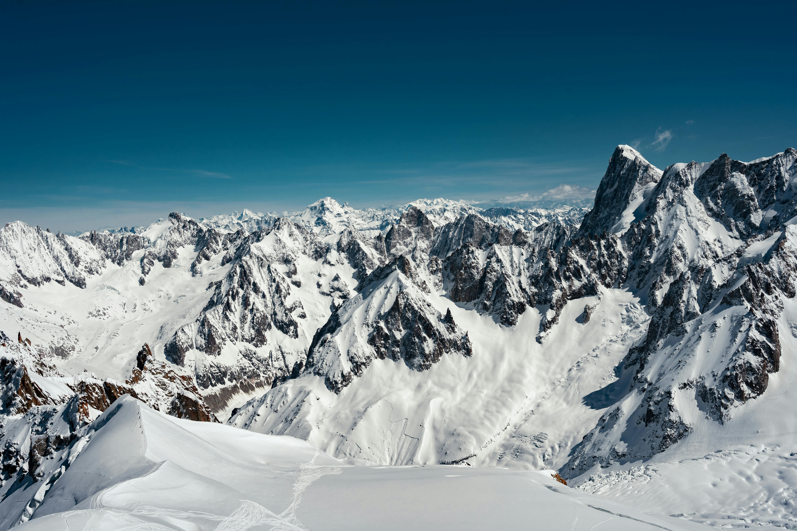

## Why Miage? 

Growing up Lago del Miage, outside of Courmayeur, was one of the hikes often done when visiting family in Italy. The lake had a destinctive `J` shape which I always associated with my sister: Julia. In 2023 Julia got married in Courmayeur, and the day after we hiked up to the lake. It seemed serendipedous, the lake I had always associated with my sister the day after her wedding - perfect. After an hour and a half of walking we reached the lake, and when I reached the top of the hill: nothing. Two small ponds remained. My parents explained it away as a natural process that happens every so often but it was still very disheartening.

When finding data for my data visualization class I came across a dataset on glacial lakes in Aosta, the region of Italy where Miage is. When I downloaded it I searched for Miage and found that there was some data. My goal was to see: was what I saw in 2023 just a fluke, or have conditions lead to lake losing water faster than it can be replaced. 

The Miage Glacier supplies the similarly named lake with its water. The glacier has recessed around 2 kilometers since 1820, and within my lifetime I can remember the extent getting noticably smaller. The data on the actual glacier was very tricky to access, as I needed an Italian Electronic ID card - which I do not have. Thankfully I do have a friend who graciously took time to get me said data, thank you Simone. Once I received this data the project really opened up. It contained glacial perimeters and areas from 1820 to 2005, as well as glacial lake shapefiles in 1999 and 2021. These all came together in my infographic.


Below is the code used to generate the plots for this infographic, however there was a lot of editing done in `afinity`  as well. 

```{r}
#| code-fold: true
#| echo: true
#| eval: false

#--------Load Packages-----------
pacman::p_load('tidyverse',
               'here',
               'ggthemes',
               'janitor',
               'terra',
               'tmap',
               'patchwork',
               'stars',
               'rnaturalearth',
               'showtext')

#-------- Viani et al. Evaluated glacier lakes from 1930 to 2012 ---------
lake_30 <- read_delim(here('data','VianiC_2018', 
                           'datasets', '1930s_glaciallakes.tab')) %>% 
  clean_names()

lake_70 <- read_delim(here('data','VianiC_2018', 
                           'datasets', '1970s_glaciallakes.tab'))%>% 
  clean_names()

lake_80 <- read_delim(here('data','VianiC_2018', 
                           'datasets', '1980s_glaciallakes.tab'))%>% 
  clean_names()

lake_90 <- read_delim(here('data','VianiC_2018', 
                           'datasets', '1990s_glaciallakes.tab'))%>% 
  clean_names()

lake_06 <- read_delim(here('data','VianiC_2018', 
                           'datasets', '2006_glaciallakes.tab'))%>% 
  clean_names()


lake_12 <- read_delim(here('data','VianiC_2018', 
                           'datasets', '2012_glaciallakes.tab'))%>% 
  clean_names()

# Join all data frames
lake_joined <- bind_rows(list(lake_30, lake_70, lake_80,
                           lake_06, lake_12))%>% 
  separate(event, into = c("lake", NA), sep = "_")%>% 
  filter(lake == 'Miage') # And theres the lake we want 

#--------- These next datasets come from the Aosta Geoportal --------

glacier_areas <- st_read(here::here('data',
                        'u1412_02-19-2026_20-16-06',
                        'ghiacciai_aree',
                        'ghiacciai_aree.shp'))

miage_glacier <- glacier_areas %>% 
  filter(nome == 'GLACIER DU MIAGE') # Filter for miage

miage_label <- miage_glacier[1,]

glacier_lakes <- st_read(here::here('data',
                        'u1412_02-19-2026_20-16-06',
                  'ghiacciai_laghi_epiglaciali',
                        'ghiacciai_laghi_epiglaciali.shp'))

miage <- glacier_lakes %>% 
  filter(grepl("Miage", nome_lago)) %>% 
  mutate(anno_rilie = as.integer(as.character(anno_rilie)))

glacier_lakes_2021 <- st_read(here::here('data',
                        'u1412_02-19-2026_20-16-06',
                  'ghiacciai_laghi_epiglaciali_2021',
               'ghiacciai_laghi_epiglaciali_2021.shp'))

miage_2021 <- glacier_lakes_2021 %>% 
  filter(grepl("MIAGE", nome)) %>% 
  mutate(anno_rilie = 2021)

glacier_permimeter <- st_read(here::here('data',
                        'u1412_02-19-2026_20-16-06',
                  'ghiacciai_perimetri',
               'ghiacciai_perimetri.shp'))

miage_perimeter <- glacier_permimeter %>% 
  filter(grepl("MIAGE", nome_gs)) %>% 
  mutate(anno = as.character(anno))

# ---------- Next we created the plot of TOTAL GLACIER AREA ------------

tm_layout(inner.margins = c(0.15, 0, 0, 0)) +
tm_tiles(c(CartoDB = "CartoDB.PositronOnlyLabels")) +
tm_shape(miage_perimeter) +
  tm_lines(
    col = 'anno',
    col.scale = tm_scale_ordinal(values = 'brewer.blues'),  
    col.legend = tm_legend(
      title = 'Year',
      labels.format = list(big.mark = ''),
      orientation = 'landscape',
      position = c(0, .1),
      bg.color = '#876D4D'
    ),
    col_alpha = 'anno',
col_alpha.scale = tm_scale_ordinal(values = seq(.4, 1, length.out = 8)),
    lwd = 'anno',
    lwd.scale = tm_scale_ordinal(values = seq(8, 1, length.out = 8)),# adjust 8 to number of years
  lwd.legend = tm_legend(show = FALSE),
col_alpha.legend = tm_legend(show = FALSE)
  ) +
tm_shape(miage_label) +
  tm_text(
    text = 'nome', col = 'black',
    xmod = -.9, ymod = -3.2, angle = -45, size = .7
  ) +
tm_compass(type = "4star", size = 2, position = c("right", "top"))
  
tmap_save(filename = 'MAP.pdf')

#------------- Next was the Miage lake in 1999 and 2021 ----------------

miage <- miage %>% 
  filter(anno_rilie == '1999')

miage_2021 <-  miage_2021 %>% 
  filter(!nome %in% c('MIAGE I', 
                     'MIAGE II',
                     'MIAGE III',
                     'MIAGE IV',
                     'MIAGE V'))


miage_map <- tm_shape(miage_2021)+
tm_layout(bg.color = '#876D4D',
          outer.bg.color = '#876D4D', # This is essentially cobolt style but works with the legend I add 
          frame.color = NA,
          frame.lwd = 0)+
tm_shape(miage) + # Add lake in 2006 and 1999
  tm_polygons(fill = 'anno_rilie',
              fill.scale = tm_scale_categorical(values = c('lightblue', 'lightblue')),
               fill.legend = tm_legend(show = FALSE))+
   tm_tiles(c(CartoDB = "CartoDB.PositronOnlyLabels"))+
  tm_shape(miage_glacier)+ # Add the glacier
  tm_polygons(fill = 'white',
              col = '#08316B',
              lwd = 3)+
  tm_shape(miage_2021)+ # add 2021 lake
  tm_polygons(fill = 'anno_rilie',
              fill.scale = tm_scale_categorical(
                values = 'red'),
              fill.legend = tm_legend(show = FALSE))+
  # Add a legend so we can include the 2 different sets
tm_add_legend(type = 'polygons', 
              labels = c('1999', '2021'), 
              fill = c('lightblue', 'red'),
               bg.color = "#876D4D",
              text.color = 'white',
              title.color = 'white',
              frame.color = NA,
              frame.lwd = 2,
              title = 'Year')

tmap_save(filename = 'MIAGE_MAP.pdf', miage_map)  

#------------ And lastly the plot of the Miage Area over time------------

# Add font

font_add_google(name = 'Fira Sans Condensed', # Fire sans for non-title
                family = 'fira_sans_condensed')

# Grab years for x-axis
years <- lake_joined %>% 
  filter(grepl("Miage", lake)) %>% 
  pull(date_time) %>% 
  unique()

miage_area <- lake_joined %>% 
  filter(grepl("Miage", lake)) %>% 
  group_by(date_time) %>% 
  summarize(total_area = (sum(area_m_2, na.rm = TRUE))) %>% 
  ggplot(aes(x = date_time, y = total_area)) +
  geom_line(color = '#68452E',
            lwd = 3)+
  geom_point(size = 4)+
  scale_x_continuous(breaks = years)+
  scale_y_continuous(labels = scales::comma)+
  labs(
    x = 'Year',
    y = 'Area (Meters<sup>2</sup>)'
  )+
  theme_tufte()+
  theme(
        plot.background = element_rect(fill = '#048F7A'), # Cobalt 
        axis.title =  ggtext::element_markdown(color = 'black',
                                  family = 'fira_sans_condensed',
                                  size = 20),
        axis.title.y = ggtext::element_markdown(),
        axis.text = element_text(color = 'black',
                                 family = 'fira_sans_condensed',
                                 size = 12),
        plot.title = element_text(color = 'black',
                                  family = 'quicksand'),
        axis.line = element_line(color = "black", size = 1)
        )

showtext.auto(enable = TRUE)
miage_area

ggsave(filename = 'AREA.pdf', width = 1500, 
       height = 1000, units = 'px')
showtext.auto(enable = FALSE)
```

## Design and approach

The basis of this infographics is maps. Before this project I was sick of maps, and I still am. They are really hard to show from a data visualization perspective, especially when zooming in on an area that is pretty remote. This graphic format necessitates a reference as to where we are, which is hard to do with most basemaps. I settled on this beautiful visualization from Johann Georg Mayr in 1874 which gives this old paper feel - almost like an old trail guide (Mayr, J. G. (1874)). I tried to keep this trail- guide aesthetic throughout. In my text I decided to do dual text in English and Italian, with flag markers you would commonly see in the area. Furthermore, all my text is 'spoken' by an alpine guide png which I put together as if a guide is giving a hiker information. I wanted to keep my theme consistent on this so I referenced some trail maps from the area to lock in on my visuals. One thing that is striking about the area is the colors of the nature, so all my colors came from pictures of the landscape. I tested my colors using a color blind simulator extension through google chrome. My color palette was this: 


Typography is tricky for me, as it is something I don't really think about naturally. Personally I have no differentiation between serif versus sans. My title font, `Academy Engraved LET`, was chosen because of its 'gravitasse' as well as its similarity to my basemap. My main text font for my annotations `DIN Condensed` was chosen for readability. For my plots I chose a font - `Fira Sans Condensed` - as it displays well on the picture of the actual miage lake. My data to ink ratio is very high, but It gives the feel of the old trail maps which comes first for my purposes. In the future I would love to reach out to locals to see their opinion of the lake and its decline. 

## Conclusion 

Along with the data-driven infographic, I also looked at the literature. According to Masetti et al. the lake does in fact go through periods of rapid draw down followed by a gradual refill. One such drawdown period saw about 320,000 m<sup>3</sup> of water in a period between 48 and 72 h (Masetti et al. 2009). 
The issue is in recent years refill has not kept up with the drawdown. Will the lake fill up again? Hopefully! However going on year 4 of this low level of lake does not inspire much hope. 


## References 

### Data
Viani, Cristina (2018): Inventories of glacier lakes in the Western Italian Alps from the 1930s to 2012 [dataset publication series]. PANGAEA, https://doi.org/10.1594/PANGAEA.896023,

Glacier perimeters (2005):
Regione Valle d'Aosta. (2005). Perimetri ghiacciai [Dataset]. Catasto Ghiacciai, Geoportale Regionale. https://mappe.regione.vda.it/pub/geoCartoSCT/

Glacial lakes (2021):
Regione Valle d'Aosta. (2021). Laghi glaciali [Dataset]. Catasto Ghiacciai, Geoportale Regionale. https://mappe.regione.vda.it/pub/geoCartoSCT/

### Background
Mayr, J. G. (1874). Atlas der Alpenländer. Blatt IV [Map]. Justus Perthes. David Rumsey Map Collection, No. 14243.005. https://www.davidrumsey.com

Masetti, M., Diolaiuti, G., D'Agata, C., & Smiraglia, C. (2009). Hydrological characterization of an ice-contact lake: Miage Lake (Monte Bianco, Italy). Water Resources Management, 24, 1677–1696. https://doi.org/10.1007/s11269-009-9519-x


