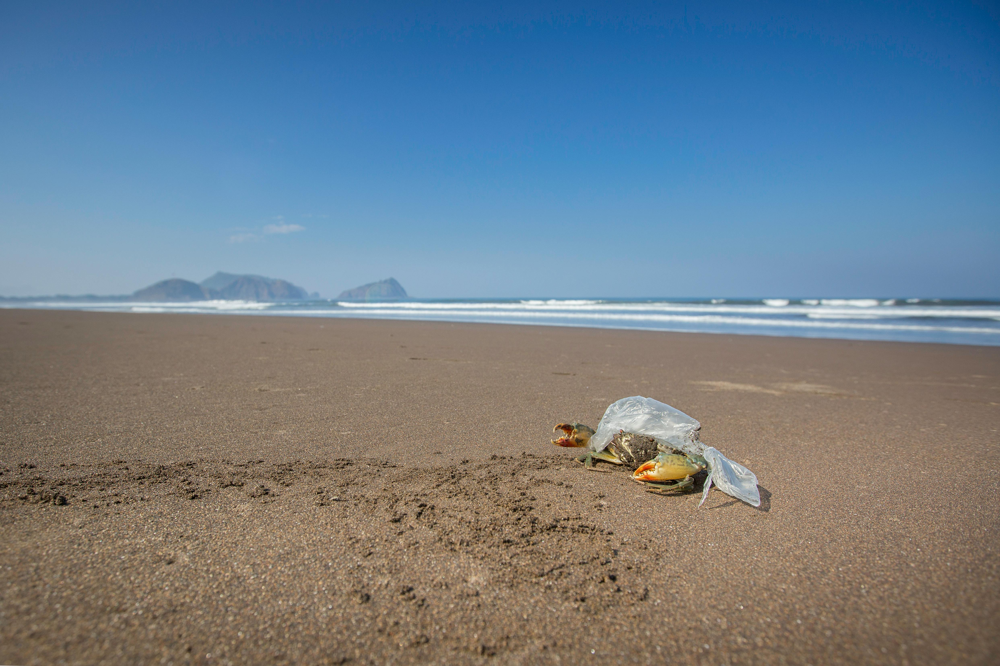
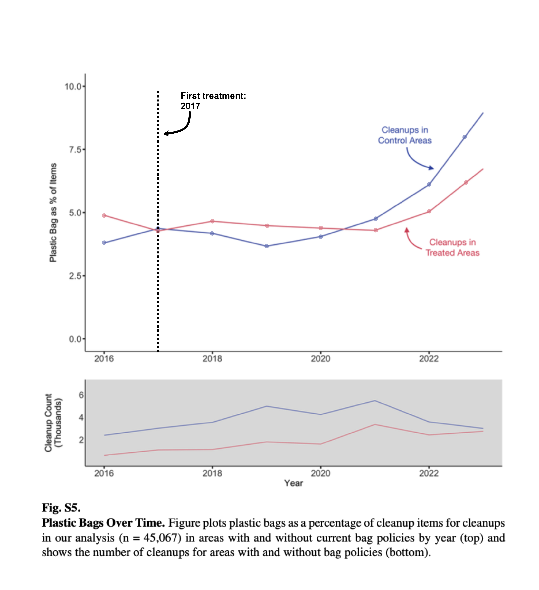
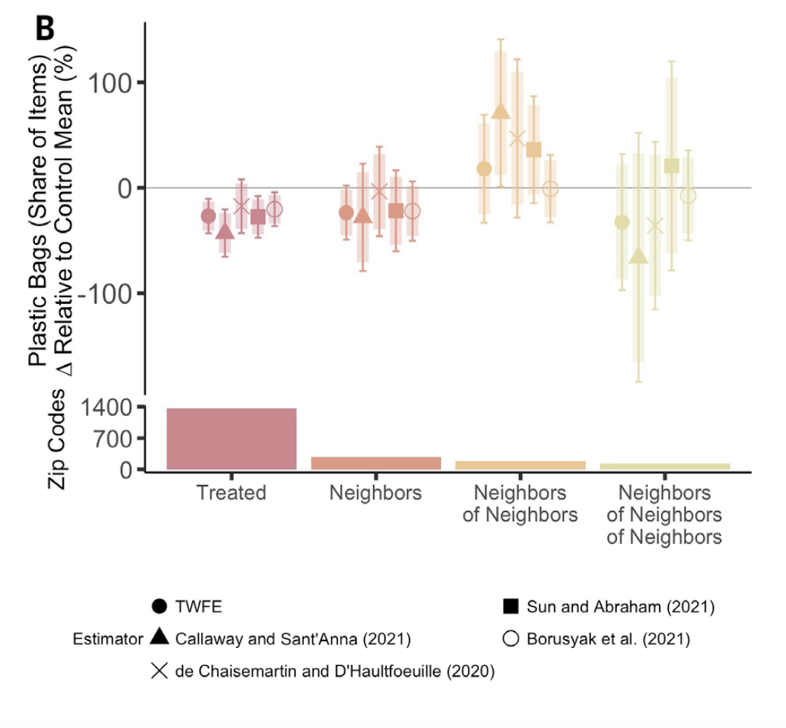
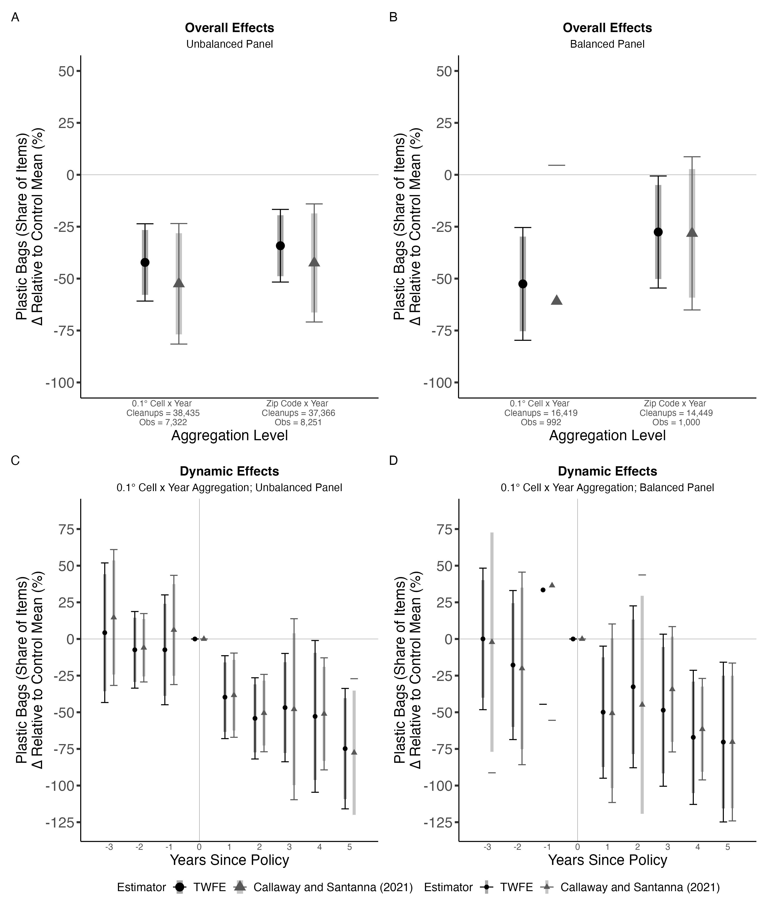

## Background

Across the United States growing concern over plastic bag pollution in marine and freshwater environments has prompted jurisdictions at multiple levels to propose and enact policies restricting plastic bag distribution. The goals of these policies are to reduce plastic bags at the point of consumption and prevent bag litter from ending up in downstream bodies of water. At the same time, this trend has prompted some opposing states to issue bans on bag policies, superseding plastic bag policies enacted by lower jurisdictions. While existing research finds that plastic bag policies reduce bag consumption [@taylor2015] no systematic studies prior to this paper examine the causal linkage between enacting bag policies and reductions in bag pollution [@papp2025]. The authors look at jurisdictions at the city, county, and state levels that have enacted plastic bag policies, as bans or fees, that also had regular, volunteer-attended shoreline litter cleanups. The study uses a difference-in-differences (DiD) causal identification approach with five different variations of estimators including a simple two-way fixed effects (TWFE) regression model controlling for the panel data varying across location (zip code, grid cell) and time (year). The analysis uses both overall effects (s1) and dynamic effects (s2) to estimate an event-study version of the TWFE model.

## Data Description {#gitsec-data}

Each row of the processed study data represents a shoreline cleanup event at a unit of observation, year, treatment status, outcome measurement, number and age group of attendees, distance covered, and median income.

Two units of observation are used: zip codes to aggregate plastic bag policies and 0.1° cells (\~ 11.1 km2) to aggregate shoreline cleanup events between the time period January 2016 and December 2023, aggregated by year. The geographic scope of these observations span the entire United States, including Hawaii and Alaska.

Treatment is measured as a binary constructed variable of having a plastic bag policy, beginning in the first full year after policy enactment between January 2017 and December 2023. Plastic bag policies are counted as any of the following restrictions: complete bans (no plastic bag distribution), partial bans (only bags of thickness greater than 2.25mm permitted), and fees (5 to 25 cent surcharge for each bag consumed) enacted at the town, city, or state level. In total, 182 policies were considered in the analysis.

The outcome measurement is the plastic bags collected as a percentage of total items collected from shoreline cleanups. Percentage of total items collected in shoreline cleanups is used as a proxy for the overall reduction in plastic bags in aquatic environments. Additionally, a constructed variable for plastic bags is used, composed of both plastic grocery bags and other plastic bags, due to ambiguity in identification between the two by cleanup attendees.

Fixed effects for time and location are both used in this study to control for when cleanups occur during the year, while location fixed effects control for unit characteristics such as environmental attitudes within a community, differences in litter behavior, and income.

### Data Cleaning

A number of observations were dropped resulting in a sample size of 45,067 shoreline cleanups. Of the original 118,414 observations: 15,230 cleanup events dropped that lacked item-level information, 2,625 events were dropped that failed to record distance covered and weight of litter collected, and 2,694 outlier events were dropped that had the top percentile of distance covered per attendee, items collected per attendee, and items collected per attendee per unit distance.

The resulting 97,775 cleanup events were further reduced to the final sample size based primarily on: areas with existing bag policies, cleanup events with low item identification certainty, and to account for spillover effects. Areas with existing bag policies as of 2016, like California, and areas with bag policies that were implemented but later repealed, like towns and counties in Florida and Texas, were excluded. Including these areas would interfere with treatment measurement, as the policies would not have started during the treatment period. Because cleanup events are often carried out by public volunteers as part of citizen science initiatives, the accuracy of data collection is a concern to this study. For this reason, cleanups with children attendees were excluded, as item identification and recording may be hindered.

Finally, this study handles spillover by removing observations that are neighbors, neighbors of neighbors, and neighbors of neighbors of neighbors of treated and dropped observations. The justification for this is based on imprecise initial findings of potential positive spillover to immediate neighbors of treated areas and potentially negative spillover in neighbor of neighbors. This point will be addressed further in the [Model Justification](#sec-model) section.

## Model Justification {#sec-model}

Papp and Oremus utilize a difference and difference casual model with multiple estimators. For our project, we selected two of these estimators for simplicity: 

### *Two Way Fixed Effects (TWFE)*

::: panel-tabset
### Overview

**Overview:** Year and zip code fixed effects with a single treatment indicator.

### Estimand

**Estimand:** ATT (average over all treated units). Example: average change in plastic bag share over all treated zip codes.

### Core approach

**Core approach:** OLS regression with unit and time fixed effects; single treatment indicator.

### Handles staggered adoption?

**Handles staggered adoption:** Yes, but the results can be biased when treatment effects are heterogeneous. In our case this could be an issue as the different bag laws may vary in their outcomes. 
### Control group

**Control Group:** All untreated units **and already-treated units** (implicitly).
:::

### *Callaway & Sant'Anna (CS)*

::: panel-tabset
### Overview

**Overview:** Aggregate cohort-specific DiD estimates using clean comparisons only. Uses `base_period = "universal"` for a shared baseline across cohorts.

### Estimand

**Estimand:** Cohort-specific ATT (g,t) for each treatment cohort *g* and period *t*. Treatment cohort defined as first clean year after policy (`firstCS`).

### Core approach

**Core approach:** Compute group-time treatment effects and aggregate across cohorts using valid comparisons.

### Handles staggered adoption?

**Handles staggered adoption:** Not only does this model handle staggered adoption (eg. plastic bag laws being implemented at different rates), it is specifically designed for it. 

### Control group

**Control Group:** Not-yet-treated units.
:::

The difference and difference approach requires a core assumption of parallel trends. This assumption states treatment and control units, locations (zip code or grid cell) with and without bag policy, would follow the same trend in the absence of policy. The outcome variable, percent plastic bag share of total items collected, must be parallel in treatment and control areas before policy is enacted. This allows a causal identification that without policy in a counterfactual scenario, the trend lines likely would have continued in the pre-treatment trajectory.

### Testing assumptions and violations

**Parallel Trends** This assumption was tested visually with a plot of plastic bags as percent of cleanup items against time for the cleanups in control areas and clean-ups in treated areas (Fig S5). The first policies occurred in 2017, with staggered implementation across treatment locations from 2016 until 2023 for the 182 policies analyzed.



Cleanup data from control and treated areas should show variation due to regional and contextual differences. However, the trend between the two requires parallel lines to infer causal impact of the policy treatments due to omitted time-varying confounders. The figure shows a negative slope in treated areas and a positive slope in control areas, with an intersection point near the point of first treatment in 2017.

The volume of data collection is shown in the plot below comparing the cleanup counts over time between control and treatment areas. Prior to policy implementation in 2017, there is a strong case for parallel trends in the cleanups themselves. This plot does not illustrate the outcome variable of interest and cannot stand alone to support the direct causal claim of bag policy changing plastic bag share of total items collected.

The trend is further visualized in the dynamic effects model ([Figure 2](#fig-2) panel b and d). For a strong parallel trend, treated units in the years before the policies should show no differential trend in plastic bag share relative to controls, expressed as a fraction of the baseline control mean 4.5%. However, the width of the 95% confidence interval spanning values substantially different from zero suggests imprecision and an inability to rule out pre-existing differential trends.

**Stable Unit Treatment Value Assumption (SUTVA)**

There must be no spillovers between treated units and control units. The policy impact in one location (zip code or grid cell) must not impact the outcome in areas without policies. The study acknowledges the interconnectedness of waterways as well as potential behavioral spillover like outsourcing plastic bag purchases to neighboring areas without policies. There could also be positive spillover effects such as changing behavior of neighboring control area stores to supply less plastic bags resulting in decreased pollution. Spillover could also occur through the confirmation bias in the cleanup locations themselves to find more plastic bags with increased awareness. Both positive and negative spillover would violate the SUTVA and dilute the treatment effect.

To test for spillover, Papp and Oremus compare zip codes of neighboring treatment areas, neighbors of neighbors and neighbors of neighbors of neighbors to the control areas to test for any significant effect (Fig 3B).

 Fig. 3 Spillover Analysis (B) Panel shows the effect of bag policies on plastic bag litter across these treatment groups, for all of the United States. Regression outcomes are according to eq. S1 using five estimators \[TWFE and (31–34)\] and using the zip code by year aggregation level. Zip codes with repealed policies (and all neighbors) are dropped from the analysis. The outcome variables are plastic bags’ share of total items collected on shoreline cleanups documented in TIDES, divided by the control mean. Thick lines show a 90% confidence interval, and thin lines show a 95% confidence interval. Standard errors are clustered by zip code.

All neighboring zip codes of treatment areas do not have statistically significant effects, indicating that the spillover assumption is met. However the immediate neighbors may have slight positive effects while the neighbors of neighbors indicate slight negative effects (Fig 3B). To remediate any potential doubt, Papp and Oremus remove 3 degrees of location away from the treated location, such as 3 zip codes away, for the final analysis.

**Strict Exogeneity** To meet this assumption the treatment must be independent of the error term across all time periods. Papp and Oremus propose a scenario that while the decision to implement a policy in a locality may be endogenous, the timing of implementation is likely exogenous due to the process of law implementation. Exogeneity is examined in the dynamic effects model showing treated units in pretreatment years compared to control. However, divergence from the control units before the ban could reflect either anticipation effects or omitted time-varying confounders. The bias created from contaminating the base year in the former threatens causal identification, while the latter threatens the parallel trends assumption.

### Model Variations

**Overall effects:** Tested by a two-way fixed effects regression.

$$y_{it} = \beta D_{it} + \gamma_i + \delta_t + \epsilon_{it}$$ 

-  $y_{it}$, the outcome variable, is the plastic bag percent share of total items 

-  i, the unit, is the 0.1 latitude/longitude grid cell 

-  t, the time, is years Dit, the dummy variable, is one in years after the beginning of a plastic bag policy in unit i 

-  i , a fixed effect, controls for the spatial unit i, a fixed effect, controls for year

The overall effects output one summary number, answering the question on average, do bag policies work. The collapsed estimate hides any effect over time which the dynamic effects model can answer.

Results are presented with spatial units in both the main analysis, grid cell, and zip code as a robustness measure. Grid cells are uniform, yet arbitrary in terms of boundaries while zip codes are variable sizes and follow administrative boundaries. The side by side comparison provides sufficient evidence that the spatial aggregation choice isn't driving the results.

**Dynamic effects:** Event-study two-way fixed effects

$$y_{it} = \beta_k \sum_{k=-3}^{6} D_{k(i)} + \gamma_i + \delta_t + \epsilon_{it}$$

-  $y_{it}$, the outcome variable, is the plastic bag percent share of total items 

-  i, the unit, is the 0.1 latitude/longitude grid cell 

-  t, the time, is years Dk(i), the dummy variable, is one if the introduction of the policy was k years away for unit i 

-  i , a fixed effect, controls for the spatial unit i, a fixed effect, controls for year

The dynamic effects model answers the question of does bag policy work and when. For a causal interpretation of this model in figure 2, with results normalized by the control mean, the parallel trends should be visualized with a flat trend pre-treatment and statistically indistinguishable from zero to indicate no differential trend in plastic bag share relative to controls.

**Unbalanced vs balanced**

The balanced panel is a subset of locations that have at least one annual cleanup a year. The unbalanced panel is inclusive of all locations with cleanups though the clean up dates may be sporadic and subject to seasonal variation affecting pollution patterns. Both panels are inputted to the model estimators and shown side by side.

### Estimator comparisons

Papp and Oremus utilize multiple estimators. The focus of our analysis is on the Two-way fixed effect (TWFE) and Callaway and Sant’Anna (2021) estimation methods. A standard two-way fixed effect creates bias in heterogeneous treatment effects. With policy enactments varied through time, the estimator must account for this bias. Callaway and Sant’Anna (2021) created a cohort-specific average treatment effect on the treated (g,t) for each treatment cohort g and period that addresses this bias.

## Code Replication

### Load Packages

```{r}
#| message: false
#| warning: false
library(tidyverse)
library(lfe)
library(broom)
library(here)
library(patchwork)
library(did)
library(scales)
```

### Plot theme

For this project we wanted to replicate figure 2A from [@papp2025]. To start we replicate the plot theme.

```{r}
textSize <- 15
palette  <- gray.colors(5, start = 0.0, end = 0.65, gamma = 2.2, rev = FALSE)

add_common_theme <- theme_bw() +
  theme(
    legend.position    = "bottom",
    axis.text.x        = element_text(size = textSize - 6),
    axis.text.y        = element_text(size = textSize),
    axis.title.x       = element_text(size = textSize),
    axis.title.y       = element_text(size = textSize,
                                      margin = margin(t=0,r=0,b=0,l=-4)),
    legend.text        = element_text(size = textSize - 3),
    legend.title       = element_text(size = textSize - 3),
    legend.margin      = margin(0,0,0,0),
    legend.spacing.x   = unit(0, "mm"),
    legend.spacing.y   = unit(0, "mm"),
    panel.grid.major   = element_blank(),
    panel.grid.minor   = element_blank(),
    panel.border       = element_blank(),
    axis.line          = element_line(colour = "black"),
    axis.ticks         = element_line(linewidth = 1),
    axis.ticks.x       = element_blank(),
    axis.ticks.length  = unit(0.15, "cm"),
    plot.title         = element_text(hjust = 0.5, face = "bold"),
    plot.subtitle      = element_text(hjust = 0.5)
  )
```

### Preparing panel data

The data in this study is described in the [Data Description](#sec-data) section, however we need to prepare our two datasets. To do this we use a function, however this process could be manually reproduced for each dataset.

```{r}
prepare_panel <- function(file, 
                          panel_type, # Balanced vs unbalanced panel 
                          group_id_var, # .1 degree grid cell or zip code
                          outcome = "percPlasticBag", # Set outcome
                          drop_years = NULL,  # Included if one needs to drop years for their analysis 
                          treated_only = FALSE, # Keep only treated
                          single_treatment = FALSE,  # Include only a single treatment 
                          use_grocery = FALSE) { # Grocery bags are sometimes not counted as plastic bag 
  
# Stop if file is not found 
  if (!file.exists(file)) stop("File not found: ", file)
  e <- new.env()
  load(file, envir = e) # Load desired file

  # If you have balanced, it checks that the data is balanced
  if (panel_type == "balanced") {
    if (exists("dataBalanced", envir = e)) {
      data <- e$dataBalanced
    } else {
      stop("No 'dataBalanced' object in: ", basename(file),
           "\nObjects found: ", paste(ls(e), collapse = ", "))
    }
    
    # If not we just want to make sure data is present data
  } else {
    if (exists("data", envir = e)) {
      data <- e$data
    } else {
      obj <- ls(e)[1]
      message("No 'data' object found; using '", obj, "' from ", basename(file))
      data <- get(obj, envir = e)
    }
  }
  
# Sometimes grocery bags and plastic bags are differentiated, but for our purposes they are the same
  if (use_grocery) data <- data %>% mutate(percPlasticBag = percGroceryBag)
  
# If we want to drop years this lets us do that (the paper discusses wanting to drop covid)
  if (!is.null(drop_years)) data <- data %>% filter(!year %in% drop_years)
  
# If we only want treated, then we only take treated
  if (treated_only) data <- data %>% filter(type != "control")
  
# Create single treatment effect
  if (single_treatment) {
    data <- data %>%
      filter(lastPolicyID == firstPolicyID |
             is.na(lastPolicyID) | is.na(firstPolicyID))
  }

  # Numeric time (year-level only for Figure 2)
  data <- data %>% mutate(time = year)

  # First treatment year — convert outside mutate to avoid recycling issues
  fe <- data$firstEffect
  if (inherits(fe, "POSIXct") || inherits(fe, "Date")) {
    data$firstY <- as.numeric(format(as.Date(fe), "%Y"))
  } else {
    data$firstY <- suppressWarnings(as.numeric(as.character(fe)))
  }

  # Filter types of bag bans 
  dataMain <- data %>%
    filter(type %in% c("charge", 
                       "complete", "
                       partial", 
                       "control"))

  # Group-level treatment variables 
  dataMain <- dataMain %>%
    group_by(!!sym(group_id_var)) %>% # !! unquotes it so the column is evaluated, sym does the same thing so its double checking 
    mutate(
      treat      = treatedAny,
      treatEver  = sum(treatedAny) > 0,
      timeToTreat = if_else(treatEver, time - firstY, 0),
      firstSA    = if_else(treatEver, firstY + 1, 10000), # No treatment -> no first year
      treatDCDH  = treatedAny == 1 & time >= firstY, 
      firstCS    = if_else(is.na(firstY), 0, firstY + 1) # First 'clean' year  
    ) %>%
    ungroup()

  # Drop units with inconsistent firstCS (varying treatment cohort)
  dataMain <- dataMain %>%
    group_by(!!sym(group_id_var)) %>% 
    mutate(min_cs = min(firstCS), max_cs = max(firstCS)) %>%
    ungroup() %>%
    filter(min_cs == max_cs)

  
  dataMain %>% arrange(!!sym(group_id_var), time)
}
```

### Estimators function

In the study they used 5 estimators, however for the purpose of clarity we downgraded to two: Two Way Fixed Effects (TWFE) and Callaway & Sant'Anna 2021 (CS). Background on these estimators can be found in the [Model Justification](#sec-model) section. Again we made this a function so it can work with our multiple datasets

```{r}
run_static_estimators <- function(dataMain, 
                                  group_id_var,
                                  drop_sa_years = NULL) {

  # Control mean - a static value
  control_mean <- dataMain %>%
    filter(type == "control") %>%
    summarise(m = mean(percPlasticBag, na.rm = TRUE)) %>%
    pull(m)

  results <- list()

  # ---- 1. TWFE ----
  fml <- as.formula(paste0(
    "percPlasticBag ~ treat | factor(time) + factor(", group_id_var, ") | 0 | zip"
  ))
  
  # Fit a linear model with multiple fixed effects
  m <- felm(fml, data = dataMain)
  
  # Summarizes information about model components
  r <- tidy(m, conf.int = TRUE) %>% # Tidy = Broom command that makes output readable
    mutate(model = "TWFE") %>%
    dplyr::select(model, estimate, std.error)
  results[["TWFE"]] <- r

  
  # ---- 2. Callaway & Sant'Anna 2021 ----
  
  atts <- att_gt(data = dataMain, 
                 yname = "percPlasticBag", # Outcome
                 tname = "time", # Time variable
                 idname = group_id_var, # Id variable
                 gname = "firstCS", # First period where treated
                 clustervars = "zip", # Grouping variable
                 control_group = "notyettreated", 
                 bstrap = TRUE, # Bootstrap
                 biters = 1000, # Number of bootstraps 
                 allow_unbalanced_panel = TRUE, 
                 panel = TRUE,
                 base_period = "universal")
  # A universal base period fixes the base period to always be (g-anticipation-1). This does not compute pseudo-ATT(g,t)'s in pre-treatment periods, but rather reports average changes in outcomes from period t to (g-anticipation-1) for a particular group relative to its comparison group. This is analogous to what is often reported in event study regressions.
  
  
#  Take group-time average treatment effects and aggregate them into a smaller number of parameters
  agg  <- aggte(atts, type = "group", na.rm = TRUE)
  results[["CS"]] <- data.frame(
    model     = "Callaway and Santanna (2021)",
    estimate  = agg$overall.att,
    std.error = agg$overall.se
  )
  
  # ---- Combine & normalise ----
  bind_rows(results) %>%
    # Normalize estimate over control mean 
    mutate(
      estimate   = estimate   / control_mean,
      std.error  = std.error  / control_mean,
      # We use the confidence estimates from the paper, so we get upper and lower bounds
      confLow    = (estimate - 1.96  * std.error) * 100, 
      confHigh   = (estimate + 1.96  * std.error) * 100,
      confLow90  = (estimate - 1.645 * std.error) * 100,
      confHigh90 = (estimate + 1.645 * std.error) * 100,
      estimate   = estimate * 100,
      std.error  = std.error * 100,
      model = factor(model, levels = c(
        "TWFE",
        "Callaway and Santanna (2021)"
      ))
    )
}
```

### Run functions

Now we can run our panel data and estimator function over our datasets.

```{r}
#| warning: false
#| message: false
#| results: hide


# --------------RUN — UNBALANCED PANEL----------------------


data_unbal_cell <- prepare_panel(
  file         = here("replication_shared",
                      "data",
                      "processed",
                      "02_merged_bigcell_year.rda"),
  panel_type   = "unbalanced", # The sauce: easy unbalanced vs balanced
  group_id_var = "groupID1" # This is the 11 degree blocks from the paper
)

data_unbal_zip <- prepare_panel(
  file         = here("replication_shared",
                      "data",
                      "processed",
                      "02_merged_zip_year.rda"),
  panel_type   = "unbalanced",
  group_id_var = "zip" # Zip codes
)

# Here we differentiate between the 0.1° degree grid cells and zip codes
static_unbal_cell <- run_static_estimators(data_unbal_cell, "groupID1")%>%
  mutate(version = "0.1° Cell x Year", x = 0) 

static_unbal_zip  <- run_static_estimators(data_unbal_zip,  "zip")%>%
  mutate(version = "Zip Code x Year",  x = 1)

static_unbal <- bind_rows(static_unbal_cell, static_unbal_zip)

dynamic_unbal <- run_dynamic_estimators(data_unbal_cell, "groupID1")

# Here we count the unbalanced grid cells and zips as well the number of observations 
count_unbal_cell <- sum(data_unbal_cell$cleanupCount)

nobs_unbal_cell  <- nrow(data_unbal_cell) 

count_unbal_zip  <- sum(data_unbal_zip$cleanupCount) 

nobs_unbal_zip   <- nrow(data_unbal_zip)


# ---------------- RUN — BALANCED PANEL -----------------------------------


data_bal_cell <- prepare_panel(
  file         = here("replication_shared",
                      "data",
                      "processed",
                      "02_merged_bigcell_year_balanced.rda"),
  panel_type   = "balanced",
  group_id_var = "groupID1"
)

data_bal_zip <- prepare_panel(
  file         = here("replication_shared","data","processed","02_merged_zip_year_balanced.rda"),
  panel_type   = "balanced",
  group_id_var = "zip"
)

static_bal_cell <- run_static_estimators(data_bal_cell, 
                                         "groupID1") %>%
  mutate(version = "0.1° Cell x Year", x = 0)
static_bal_zip  <- run_static_estimators(data_bal_zip,  
                                         "zip")%>%
  mutate(version = "Zip Code x Year",  x = 1)

static_bal <- bind_rows(static_bal_cell, static_bal_zip)

dynamic_bal <- run_dynamic_estimators(data_bal_cell, "groupID1")

count_bal_cell <- sum(data_bal_cell$cleanupCount)
nobs_bal_cell  <- nrow(data_bal_cell)
count_bal_zip  <- sum(data_bal_zip$cleanupCount)
nobs_bal_zip   <- nrow(data_bal_zip)

# Update for plotting
static_unbal <- static_unbal%>% 
  mutate(model = droplevels(model))

static_bal   <- static_bal%>% 
  mutate(model = droplevels(model))

dynamic_unbal <- dynamic_unbal%>% 
  mutate(model = droplevels(model))

dynamic_bal   <- dynamic_bal%>% 
  mutate(model = droplevels(model))
```

### Plot

Here we plot out our model results, in four panels representing:

-   A : Overall unbalanced effects

-   B : Overall balanced effects

-   C : Dynamic unbalanced effects

-   D : Dynamic Balanced effects

The balanced data comes from the original study, and is balanced on whether there were consistent yearly cleanups. The overall effects are the static single value effects, wheras the dynamic effects add the year into the model, which gives a Year-Over-Year effect of plastic bag policies on the prevelance in cleanups. 

```{r}
#| warning: false
#| message: false
#| fig.show: hide


my_palette <- palette[1:2]

x_labels_unbal <- c(
  paste0("0.1° Cell x Year\n Cleanups = ", comma(count_unbal_cell),
         "\n Obs = ", comma(nobs_unbal_cell)),
  paste0("Zip Code x Year\n Cleanups = ", comma(count_unbal_zip),
         "\n Obs = ", comma(nobs_unbal_zip))
)

x_labels_bal <- c(
  paste0("0.1° Cell x Year\n Cleanups = ", comma(count_bal_cell),
         "\n Obs = ", comma(nobs_bal_cell)),
  paste0("Zip Code x Year\n Cleanups = ", comma(count_bal_zip),
         "\n Obs = ", comma(nobs_bal_zip))
)

shapes_static  <- c(16, 17)
shapes_dynamic <- c(16, 17)

# ---- Panel A: Overall, Unbalanced ----
a <- ggplot(static_unbal, aes(x = x, y = estimate, color = model, shape = model)) +
  geom_hline(yintercept = 0, colour = "grey60", linewidth = 0.2) +
  geom_errorbar(aes(ymin = confLow, ymax = confHigh),
                width = 0.25, position = position_dodge(0.5)) +
  geom_linerange(aes(ymin = confLow90, ymax = confHigh90),
                 size = 3, alpha = 0.35, position = position_dodge(0.5)) +
  geom_point(size = 4, position = position_dodge(0.5)) +
  scale_color_manual(name = "Estimator", values = my_palette) +
  scale_shape_manual(name = "Estimator", values = shapes_static) +
  scale_x_continuous(limits = c(-0.5, 1.5), breaks = c(0, 1),
                     labels = x_labels_unbal) +
  scale_y_continuous(breaks = seq(-100, 50, 25), limits = c(-100, 50)) +
  labs(y = "Plastic Bags (Share of Items)\n∆ Relative to Control Mean (%)",
       x = "Aggregation Level",
       title = "Overall Effects", subtitle = "Unbalanced Panel") +
  add_common_theme

# ---- Panel C: Overall, Balanced ----
c_plot <- ggplot(static_bal, aes(x = x, y = estimate, color = model, shape = model)) +
  geom_hline(yintercept = 0, colour = "grey60", linewidth = 0.2) +
  geom_errorbar(aes(ymin = confLow, ymax = confHigh),
                width = 0.25, position = position_dodge(0.5)) +
  geom_linerange(aes(ymin = confLow90, ymax = confHigh90),
                 size = 3, alpha = 0.35, position = position_dodge(0.5)) +
  geom_point(size = 4, position = position_dodge(0.5)) +
  scale_color_manual(name = "Estimator", values = my_palette) +
  scale_shape_manual(name = "Estimator", values = shapes_static) +
  scale_x_continuous(limits = c(-0.5, 1.5), breaks = c(0, 1),
                     labels = x_labels_bal) +
  scale_y_continuous(breaks = seq(-100, 50, 25), limits = c(-100, 50)) +
  labs(y = "Plastic Bags (Share of Items)\n∆ Relative to Control Mean (%)",
       x = "Aggregation Level",
       title = "Overall Effects", subtitle = "Balanced Panel") +
  add_common_theme

# ---- Panel B: Dynamic, Unbalanced ----
b <- ggplot(dynamic_unbal, aes(x = time, y = estimate, color = model, shape = model)) +
  geom_hline(yintercept = 0, colour = "grey60", linewidth = 0.2) +
  geom_vline(xintercept = 0, colour = "grey60", linewidth = 0.2) +
  geom_errorbar(aes(ymin = confLow, ymax = confHigh),
                width = 0.5, position = position_dodge(0.6)) +
  geom_linerange(aes(ymin = confLow90, ymax = confHigh90),
                 size = 1.5, alpha = 0.35, position = position_dodge(0.6)) +
  geom_point(size = 2, position = position_dodge(0.6)) +
  scale_color_manual(name = "Estimator", values = my_palette) +
scale_shape_manual(name = "Estimator", values = shapes_dynamic) +
  scale_x_continuous(breaks = seq(-3, 5, 1), limits = c(-3.5, 5.5)) +
  scale_y_continuous(breaks = seq(-125, 75, 25), limits = c(-127.5, 85)) +
  labs(y = "Plastic Bags (Share of Items)\n∆ Relative to Control Mean (%)",
       x = "Years Since Policy",
       title = "Dynamic Effects",
       subtitle = "0.1° Cell x Year Aggregation; Unbalanced Panel") +
  add_common_theme

# ---- Panel D: Dynamic, Balanced ----
d <- ggplot(dynamic_bal, aes(x = time, y = estimate, color = model, shape = model)) +
  geom_hline(yintercept = 0, colour = "grey60", linewidth = 0.2) +
  geom_vline(xintercept = 0, colour = "grey60", linewidth = 0.2) +
  geom_errorbar(aes(ymin = confLow, ymax = confHigh),
                width = 0.5, position = position_dodge(0.6)) +
  geom_linerange(aes(ymin = confLow90, ymax = confHigh90),
                 size = 1.5, alpha = 0.35, position = position_dodge(0.6)) +
  geom_point(size = 2, position = position_dodge(0.6)) +
  scale_color_manual(name = "Estimator", values = my_palette) +
scale_shape_manual(name = "Estimator", values = shapes_dynamic) +
  scale_x_continuous(breaks = seq(-3, 5, 1), limits = c(-3.5, 5.5)) +
  scale_y_continuous(breaks = seq(-125, 75, 25), limits = c(-127.5, 85)) +
  labs(y = "Plastic Bags (Share of Items)\n∆ Relative to Control Mean (%)",
       x = "Years Since Policy",
       title = "Dynamic Effects",
       subtitle = "0.1° Cell x Year Aggregation; Balanced Panel") +
  add_common_theme

# Assemble with patchwork 

final_plot <- (a + c_plot) / (b + d) +
  plot_annotation(tag_levels = "A") +
  plot_layout(guides = "collect") &
  theme(legend.position = "bottom")

ggsave("output/Figure2.jpeg", final_plot, width = 11, height = 13, unit = "in")

```

## Plot output and discussion

{#fig-2}

In the plot we see similar trends to the paper by [@papp2025], with both estimators finding a reduction in plastic bags relative to the control mean. In the unbalanced panel (Panel A), TWFE estimates a \~38% reduction and CS estimates a \~48% reduction at the cell level, with slightly smaller effects at the zip code level (\~32% and \~40% respectively). In the balanced panel (Panel B), TWFE estimates a \~50% reduction and CS estimates a \~63% reduction at the cell level, though the CS confidence interval is very wide and crosses zero, indicating high uncertainty.

In the dynamic panels (C and D), both estimators show increasing reductions in the post-treatment years, but with substantial uncertainty. For example, the CS estimate at year 3 in the unbalanced panel ranges from a \~10% increase to over a \~100% decrease. The wide confidence intervals, particularly in the balanced panel with only 992 observations, reflect the small sample size. However, the primary limitation of this analysis is a violation of the parallel trends assumption: control areas experienced an anomalous spike in plastic bag share after 2021, likely driven by changes in cleanup composition during COVID recovery, making causal interpretation of these estimates difficult.

## Limitations

### Measuring and sampling

The study made very distinct choices for their sampling which we carried through to our analysis, as we were working with the same data. The beach cleanup samples were dropped if there were between 5 and 25 participants, and if there were kids present in the cleanup. The authors did not justify this drop, which raises questions especially in the 5-25 margin as without justification the numbers seem arbitrary. Furthermore, the exclusion of children draws question marks as, based on personal anecdotal experience, kids being involved has no bearing into the types of litter collected or quantity. Kids being excluded also seems arbitrary as there is not a distinct age cutoff, meaning 17 year olds get treated the same as 3 year olds.

Another limitation in the sampling is the use of citizen science data. The use of this data means there was no standard methodology, meaning sampling could have been wildly different based on cleanup procedure. Furthermore the use of this data comes with the assumption that finding a plastic cap or straw is just as likely as a plastic bag.

### Code

The code in the original study is another limitation for replication. The code they used was `untidy`, with many repititions and few comments. This makes understanding and replicating their code difficult. This being said we hope that our interpretation of their code is understandable.

### Study’s conclusion summary

The study assumes "that the sample used in our analysis is representative of all plastic bag litter in the US aquatic environment". This assumption may be a stretch as there are factors the study does not consider. The first is the different outcomes between plastic litter types. The study assumes similar outcomes for plastic caps and bags. This strikes us as a bit of an overgenralization, as plastic bags are more likely to fly away and end up in the Aquatic environment than caps, making the assumption that their prevalence on land and in the water being similar a stretch. Secondly there are some omitted variables that the authors did not consider. One we came up with was beach combing. Beach combing is the practice of removing litter and wrack from beaches using large machines. This usually happens in more resedential areas in an attempt to 'beautify' the beach. This occurs unevenly across our sample sites and is not controlled for in any way, which may have skewed our results.

## Overall Takeaway 

By employing two estimators, TWFE and Callaway & Sant'Anna (2021), across both balanced and unbalanced panels and two levels of spatial aggregation (0.1° grid cells and zip codes), we find consistent evidence of plastic bag share reductions following policy enactment, ranging from 32–63% relative to the control mean. Although our results are largely consistent with the original study, the large confidence intervals and violation of the parallel trends assumption post-2021 limit causal inference. However, the results do indicate plastic bag policy is a promising avenue for addressing plastic pollution, and citizen science data is a useful proxy for aquatic litter trends.

Check out the [project repository on GitHub](https://github.com/petervitale910/EDS241-Final-Project)
